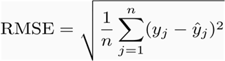
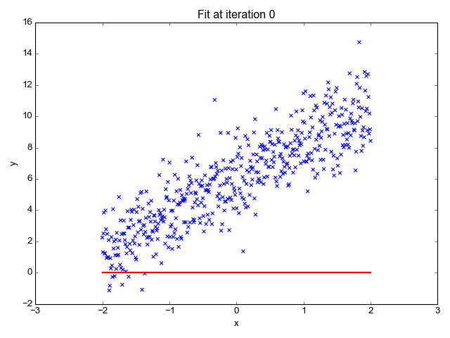
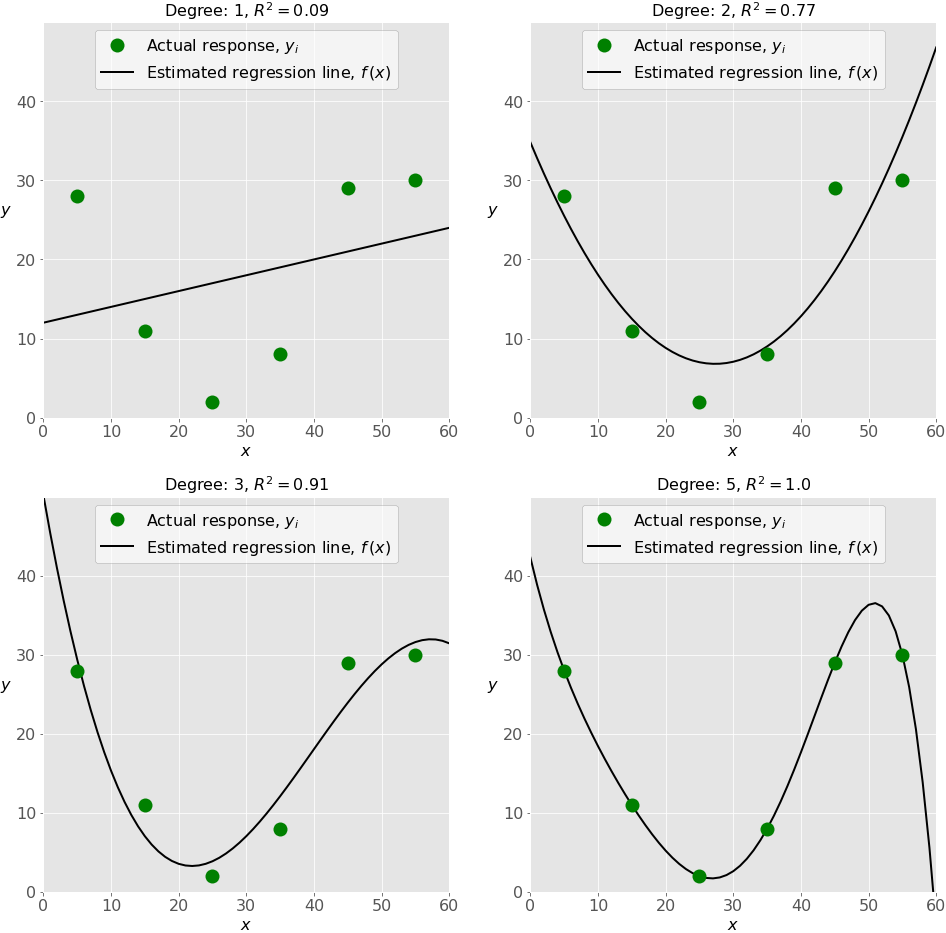

# <center>**[Cool Kids Coding School](https://www.coolkidscodingschool.com)**</center>

---
## Problem Solving with Python<br> Lesson 16: Introduction to AI (Linear Regression)


---
## Regression
Regression analysis is one of the most important fields in statistics and machine learning. There are many regression methods available. In previous lessons we discussed Logistic regression used in classification problems.  Today we are going to discuss Linear regression.


> 1.0 What is a regression?

Regression searches for relationships among variables.

For example, you can observe several employees of some company and try to understand how their salaries depend on the features, such as experience, level of education, role, city they work in, and so on.

This is a regression problem where data related to each employee represent one observation. The presumption is that the experience, education, role, and city are the independent features, while the salary depends on them.

Similarly, you can try to establish a mathematical dependence of the prices of houses on their areas, numbers of bedrooms, distances to the city center, and so on.

Generally, in regression analysis, you usually consider some phenomenon of interest and have a number of observations. Each observation has two or more features. Following the assumption that (at least) one of the features depends on the others, you try to establish a relation among them.

In other words, you need to find a function that maps some features or variables to others sufficiently well.

The dependent features are called the dependent variables, outputs, or responses.

The independent features are called the independent variables, inputs, or predictors.

Regression problems usually have one continuous and unbounded dependent variable. The inputs, however, can be continuous, discrete, or even categorical data such as gender, nationality, brand, and so on.

It is a common practice to denote the outputs with 𝑦 and inputs with 𝑥. If there are two or more independent variables, they can be represented as the vector 𝐱 = (𝑥₁, …, 𝑥ᵣ), where 𝑟 is the number of inputs.

> 2.0 What is a Linear Regressions

When implementing linear regression of some dependent variable 𝑦 on the set of independent variables 𝐱 = (𝑥₁, …, 𝑥ᵣ), where 𝑟 is the number of predictors, you assume a linear relationship between 𝑦 and 𝐱: 𝑦 = 𝛽₀ + 𝛽₁𝑥₁ + ⋯ + 𝛽ᵣ𝑥ᵣ + 𝜀. This equation is the regression equation. 𝛽₀, 𝛽₁, …, 𝛽ᵣ are the regression coefficients, and 𝜀 is the random error.

Linear regression calculates the estimators of the regression coefficients or simply the predicted weights, denoted with 𝑏₀, 𝑏₁, …, 𝑏ᵣ. They define the estimated regression function 𝑓(𝐱) = 𝑏₀ + 𝑏₁𝑥₁ + ⋯ + 𝑏ᵣ𝑥ᵣ. This function should capture the dependencies between the inputs and output sufficiently well.

The estimated or predicted response, 𝑓(𝐱ᵢ), for each observation 𝑖 = 1, …, 𝑛, should be as close as possible to the corresponding actual response 𝑦ᵢ. The differences 𝑦ᵢ - 𝑓(𝐱ᵢ) for all observations 𝑖 = 1, …, 𝑛, are called the residuals. Regression is about determining the best predicted weights, that is the weights corresponding to the smallest residuals.

To get the best weights, you usually minimize the sum of squared residuals (SSR) for all observations 𝑖 = 1, …, 𝑛: SSR = Σᵢ(𝑦ᵢ - 𝑓(𝐱ᵢ))². This approach is called the method of ordinary least squares.

Root mean squared error (RMSE): RMSE is a quadratic scoring rule that also measures the average magnitude of the error. It’s the square root of the average of squared differences between prediction and actual observation.




> 3.0 Regression Performance

The coefficient of determination, denoted as 𝑅², tells you which amount of variation in 𝑦 can be explained by the dependence on 𝐱 using the particular regression model. Larger 𝑅² indicates a better fit and means that the model can better explain the variation of the output with different inputs.

The value 𝑅² = 1 corresponds to SSR = 0, that is to the perfect fit since the values of predicted and actual responses fit completely to each other.



> 4.0 Underfitting and Overfitting

One very important question that might arise when you’re implementing polynomial regression is related to the choice of the optimal degree of the polynomial regression function.

There is no straightforward rule for doing this. It depends on the case. You should, however, be aware of two problems that might follow the choice of the degree: underfitting and overfitting.

Underfitting occurs when a model can’t accurately capture the dependencies among data, usually as a consequence of its own simplicity. It often yields a low 𝑅² with known data and bad generalization capabilities when applied with new data.

Overfitting happens when a model learns both dependencies among data and random fluctuations. In other words, a model learns the existing data too well. Complex models, which have many features or terms, are often prone to overfitting. When applied to known data, such models usually yield high 𝑅². However, they often don’t generalize well and have significantly lower 𝑅² when used with new data.

The next figure illustrates the underfitted, well-fitted, and overfitted models:



> 5.0 Example

Let’s start with the simplest case, which is simple linear regression.

There are five basic steps when you’re implementing linear regression:

    Import the packages and classes you need.
    Provide data to work with and eventually do appropriate transformations.
    Create a regression model and fit it with existing data.
    Check the results of model fitting to know whether the model is satisfactory.
    Apply the model for predictions.

These steps are more or less general for most of the regression approaches and implementations.

>> Step 1: Import packages and classes

The first step is to import the package numpy and the class LinearRegression from sklearn.linear_model:

```python
import numpy as np
from sklearn.linear_model import LinearRegression
```

Now, you have all the functionalities you need to implement linear regression.

>> Step 2: Provide data

The second step is defining data to work with. The inputs (regressors, 𝑥) and output (predictor, 𝑦) should be arrays (the instances of the class numpy.ndarray) or similar objects. This is the simplest way of providing data for regression:

```python
x = np.array([5, 15, 25, 35, 45, 55]).reshape((-1, 1))
y = np.array([5, 20, 14, 32, 22, 38])
```

Now, you have two arrays: the input x and output y. You should call .reshape() on x because this array is required to be two-dimensional, or to be more precise, to have one column and as many rows as necessary. That’s exactly what the argument (-1, 1) of .reshape() specifies.

This is how x and y look now:

```python
>>> print(x)
[[ 5]
 [15]
 [25]
 [35]
 [45]
 [55]]
>>> print(y)
[ 5 20 14 32 22 38]
```

As you can see, x has two dimensions, and x.shape is (6, 1), while y has a single dimension, and y.shape is (6,).

>> Step 3: Create a model and fit it

The next step is to create a linear regression model and fit it using the existing data.

Let’s create an instance of the class LinearRegression, which will represent the regression model:

```python
model = LinearRegression()
```

This statement creates the variable model as the instance of LinearRegression. You can provide several optional parameters to LinearRegression:

It’s time to start using the model. First, you need to call .fit() on model:
```python
model.fit(x, y)
```
With .fit(), you calculate the optimal values of the weights 𝑏₀ and 𝑏₁, using the existing input and output (x and y) as the arguments. In other words, .fit() fits the model. It returns self, which is the variable model itself. That’s why you can replace the last two statements with this one:

```python
model = LinearRegression().fit(x, y)
```

This statement does the same thing as the previous two. It’s just shorter.

>> Step 4: Get results

Once you have your model fitted, you can get the results to check whether the model works satisfactorily and interpret it.

You can obtain the coefficient of determination (𝑅²) with .score() called on model:

```python
>>> r_sq = model.score(x, y)
>>> print('coefficient of determination:', r_sq)
coefficient of determination: 0.715875613747954
```

When you’re applying .score(), the arguments are also the predictor x and regressor y, and the return value is 𝑅².

The attributes of model are .intercept_, which represents the coefficient, 𝑏₀ and .coef_, which represents 𝑏₁:

```python
>>> print('intercept:', model.intercept_)
intercept: 5.633333333333329
>>> print('slope:', model.coef_)
slope: [0.54]
```

The code above illustrates how to get 𝑏₀ and 𝑏₁. You can notice that .intercept_ is a scalar, while .coef_ is an array.

The value 𝑏₀ = 5.63 (approximately) illustrates that your model predicts the response 5.63 when 𝑥 is zero. The value 𝑏₁ = 0.54 means that the predicted response rises by 0.54 when 𝑥 is increased by one.

>> Step 5: Predict response

Once there is a satisfactory model, you can use it for predictions with either existing or new data.

To obtain the predicted response, use .predict():

```python
>>> y_pred = model.predict(x)
>>> print('predicted response:', y_pred, sep='\n')
predicted response:
[ 8.33333333 13.73333333 19.13333333 24.53333333 29.93333333 35.33333333]
```

When applying .predict(), you pass the regressor as the argument and get the corresponding predicted response.


> 6.0 Today's Problem

In today's problem we are going to try to predict housing prices in Boston.  We are going to use a dataset that describes various house features and the price of the house.

---

## **Any Questions?**

### **for any questions contact hw_help@coolkidscodingschool.com**
