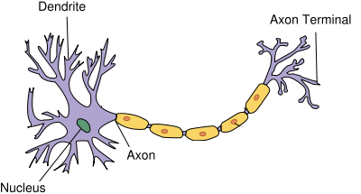
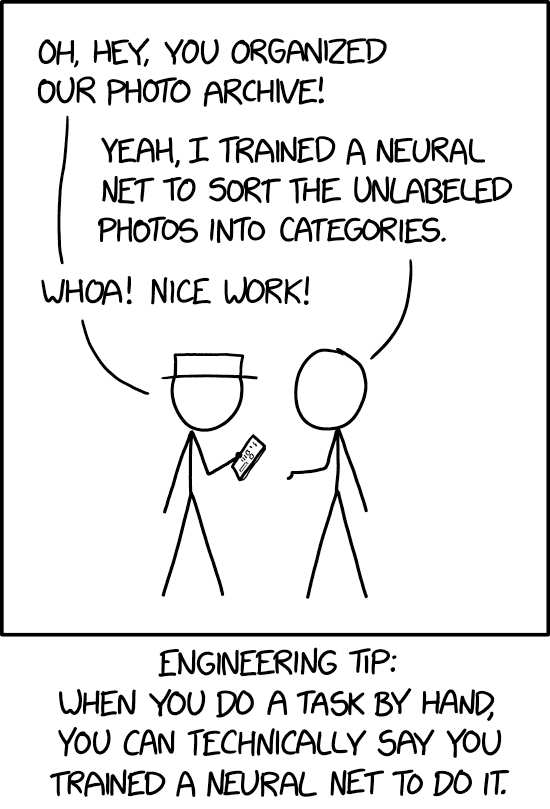

# 
**[Cool Kids Coding School](https://www.coolkidscodingschool.com)**

---

## Problem Solving with Python   Lesson 17: Introduction to AI (Neural Networks)

---

## What is a Neural Network

Humans have evolved an ability to identify patterns within the information with a high degree of accuracy. Whenever you see a car or a bicycle you can immediately recognize what they are. This is because we have learned over a period of time how a car and bicycle looks like and what their distinguishing features are. Artificial neural networks (ANN) are computation systems that intend to imitate human learning capabilities via a complex architecture that resembles the human nervous system.

In this lesson, we will just briefly review what neural networks are, what are the computational steps that a neural network goes through, and how they can be implemented using Scikit-Learn, which is the main AI library we have been using.

## The Human Nervous System

Human nervous system consists of billions of neurons. These neurons collectively process input received from sensory organs, process the information, and decides what to do in reaction to the input. A typical neuron in the human nervous system has three main parts: dendrites, nucleus, and axons. The information passed to a neuron is received by dendrites. The nucleus is responsible for processing this information. The output of a neuron is passed to other neurons via the axon, which is connected to the dendrites of other neurons further down the network.

## Perceptrons

Artificial neural networks are inspired by the human neural network architecture. The simplest neural network consists of only one neuron and is called a perceptron, as shown in the figure below:

perceptron

A perceptron has one input layer and one neuron. Input layer acts as the dendrites and is responsible for receiving the inputs. The number of nodes in the input layer is equal to the number of features in the input dataset. Each input is multiplied with a weight (which is typically initialized with some random value) and the results are added together. The sum is then passed through an activation function. The activation function of a perceptron resembles the nucleus of human nervous system neuron. It processes the information and yields an output. In the case of a perceptron, this output is the final outcome. However, in the case of multilayer perceptrons, the output from the neurons in the previous layer serves as the input to the neurons of the proceeding layer.

## Artificial Neural Network (Multilayer Perceptron)

A single layer perceptron can solve simple problems where data is linearly separable in to 'n' dimensions, where 'n' is the number of features in the dataset. However, in case of non-linearly separable data, the accuracy of single layer perceptron decreases significantly. Multilayer perceptrons, on the other hand, can work efficiently with non-linearly separable data.

Multilayer perceptrons, or more commonly referred to as artificial neural networks, are a combination of multiple neurons connected in the form a network. An artificial neural network has an input layer, one or more hidden layers, and an output layer. This is shown in the image below:

A neural network executes in two phases: Feed-Forward and Back Propagation.
Feed-Forward

Following are the steps performed during the feed-forward phase:

+ The values received in the input layer are multiplied with the weights. A bias is added to the summation of the inputs and weights in order to avoid null values.
+ Each neuron in the first hidden layer receives different values from the input layer depending upon the weights and bias. Neurons have an activation function that operates upon the value received from the input layer. The activation function can be of many types, like a step function, sigmoid function, relu function, or tanh function. As a rule of thumb, relu function is used in the hidden layer neurons and sigmoid function is used for the output layer neuron.
+ The outputs from the first hidden layer neurons are multiplied with the weights of the second hidden layer; the results are summed together and passed to the neurons of the proceeding layers. This process continues until the outer layer is reached. The values calculated at the outer layer are the actual outputs of the algorithm.

The feed-forward phase consists of these three steps. However, the predicted output is not necessarily correct right away; it can be wrong, and we need to correct it. The purpose of a learning algorithm is to make predictions that are as accurate as possible. To improve these predicted results, a neural network will then go through a back propagation phase. During back propagation, the weights of different neurons are updated in a way that the difference between the desired and predicted output is as small as possible.
Back Propagation

Back propagation phase consists of the following steps:

+ The error is calculated by quantifying the difference between the predicted output and the desired output. This difference is called "loss" and the function used to calculate the difference is called the "loss function". Loss functions can be of different types e.g. mean squared error or cross entropy functions. Remember, neural networks are supervised learning algorithms that need the desired outputs for a given set of inputs, which is what allows it to learn from the data.
+ Once the error is calculated, the next step is to minimize that error. To do so, partial derivative of the error function is calculated with respect to all the weights and biases. This is called gradient decent. The derivatives can be used to find the slope of the error function. If the slop is positive, the value of the weights can be reduced or if the slop is negative the value of weight can be increased. This reduces the overall error. The function that is used to reduce this error is called the optimization function.

This one cycle of feed-forward and back propagation is called one "epoch". This process continues until a reasonable accuracy is achieved. There is no standard for reasonable accuracy, ideally you'd strive for 100% accuracy, but this is extremely difficult to achieve for any non-trivial dataset. In many cases 90%+ accuracy is considered acceptable, but it really depends on your use-case.

## Today's Problem

In today's problem we are going run through two examples of a neural network.  The first will be a data set that we have seen before, the iris data, from KNN.  This time we are going to use a neural network to predict the type of flower.  The second exercise will be trying to predict what are a wine comes from based on various chemical attributes of that wine.

---

## **Any Questions?**

### **for any questions contact hw_help@coolkidscodingschool.com**
